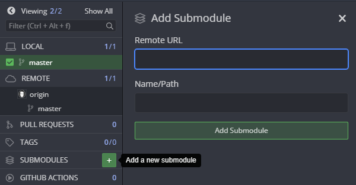
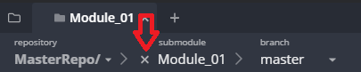
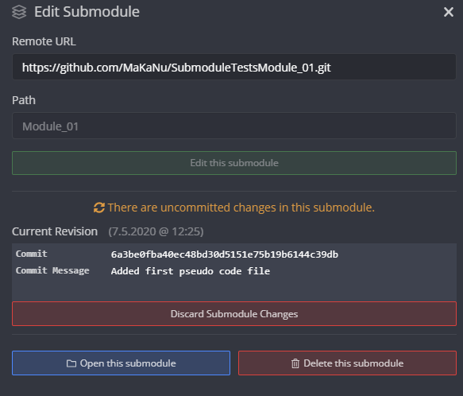

# SubmoduleTestsMaster

This Repository is for testing and documentation purposes. This parent repo will only include this README.md file and the submodules. The Submodules will include some pseudo-code to apply changes that could be commited.

Furthermore this explanation will include introduction to handle submodule with the Git Commands, Git Extensions and Gitkraken.

## Gitkraken

This Section includes the Workflow for Gitkraken. Starting with the set up of the repo , continuing with updating the submodules and ending with setting up the repo for a special commit of the submodule.

### Add the Submodules

To include the submodule into the parent repo, click on the appearing green plus button next to "SUBMODULES". This will open a window with two entry fields for the remote-URL and the path to the submodule inside the parent repo. After entering the URL the path will automatically show the reponame of the module. This path can be changed to any path/name.



After including the submodule the paren Repo needs to commit the changes. The changes are already added to the HEAD.

### Cloning a repo with submodules 

After cloning a parent repo with submodules the Module folders are empty and the Programm asked to initialize the Submodules. If this is done the submodules are on the same commit as the origin.

### Update the Submodules from the parent repo

If you change/add a file on a submodule Gitkraken show that changes are applied to the specific submodule but it is not possible to stage the changes at the moment. First you need to commit the changes in the submodule.

#### Open/apply the submodule from Diff View

When the changed but not-stage-able module is clicked the Diff View is opening. It says that there are uncommitted changes in the submodule and provides a Button to open the submodule. The submodule is then opened as a normal Repo and the changes could be commited. To switch back to the parent repo closing the Repo as ussual is not the workflow. Instead just close the submodule from tab bar as shown on the picture below. This will reopen the parent repo, otherwise the parent repo will be closed also.



Now the "Diff View" for the changed module shows the new commit and is stageable. 

#### Apply the submodule from main Window

After changing files in the submodule the specific module shows that are changes available with an icon . By double-clicking the module a popup window will appear with informations abbout the module:



When the changes are commited in the submodule and the view is reseted to the parent repo, the changes needed to be commited for the parent repo aswell. This time by using the popup window explained above. The window includes now a new button for commiting the changes. This includes an automatic commit message. As usual the commit message could be changes for the last commit.

### Update the Submodules from their own repos

This workflow appears if, as example, the remote repo is controlled by another person. If the remote is changed the parent repo is still in sync with the submodule. Now if the module is opened the difference between local and remote repo will be visible. In this case the commit linked with the parent repo is tagged as HEAD. By double clicking the local master branch, the tag will be deleted an the local branch activated. Now it is possible to pull the changes from the remote master branch. By continuing as described above the changes will be applied to the parent repo.

### Change to a specific commit

With a opened submodule the wanted commit will be checked out by right clicking the specific commit and choose the option "Check out this commit". If the Commit is checked out correctly a tag "HEAD" for this commit will be created. After closing the submodule the parent repo is no longer in sync with the submodule and the changes for the Submodule needs to be added and commited, as descriped above.

## Commandline

This section explains the workflow of working with submodule on the commandline. 

### Add the Submodules

To clone the module repo we call

```bash
$ git submodule add https://github.com/url-to-module-repo 'name-of-the-module'
```
This will add the Module as a folder with the wanted name and a configures the .gitmodules file. Running

```bash
$ git status
On branch master
Your branch is up to date with 'origin/master'.

Changes to be committed:
  (use "git reset HEAD <file>..." to unstage)

        modified:   .gitmodules
        new file:   name-of-the-module
```

will provide this information. With
```bash
$ git diff --cached --submodule name-of-th-submodule
Submodule name-of-th-submodule 00000000...abc123 (new submodule)
```
the programm provides the first 6 values of the commit, which will be added to the parent repo. As last step the new module needs to be commited:

```bash
git commit -am 'Add name-of-the-module as Submodule' -m 'Further information about the module'
```

### Cloning a repo with submodules

By cloning a repo with submodules the modules the module folder and the entries in .gitmodules are available, but the folders are empty. To collect the data from the origin to commands are necessary:

```bash
$ git submodule init
```
to register the included submodules to the parent repo and:

```bash
$ git submodule update
```

to fill the empty module folders, with the connected commit. To do this while cloning in one single command run:

```bash
$ git clone --recurse-submodule https://github.com/url-to-parent-repo 
```
This will also update nested submodules. If the parent repo is already cloned the command:

```bash
git submodule update --init --recursive
```
will fix this issue.

### Update the Submodules from the parent repo

To check for new changes the command 
```bash
$ git status
```
will show that submodules are modified but the recommended command to add the changes will not work. Instead the changed code in the submodule needs to be commited first.

```bash
$ cd name-of-the-module
$ git status
$ git add <file>
$ git commit -m "Changed File" -m "What was changed..."
```
With switching back to the parent repo the modified modules can be added and commited as usual.

### Update the Submodules from their own repos


## Git Extensions