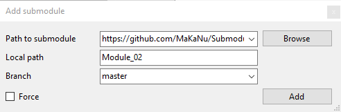
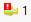
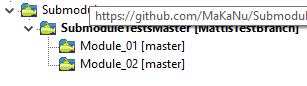

# SubmoduleTestsMaster

This Repository is for testing and documentation purposes. This parent repo will only include this README.md file and the submodules. The Submodules will include some pseudo-code to apply changes that could be commited.

Furthermore this explanation will include introduction to handle submodule with the Git Commands, Git Extensions and Gitkraken.

## Gitkraken

This Section includes the Workflow for Gitkraken. Starting with the set up of the repo , continuing with updating the submodules and ending with setting up the repo for a special commit of the submodule.

### Add the Submodules

To include the submodule into the parent repo, click on the appearing green plus button next to "SUBMODULES". This will open a window with two entry fields for the remote-URL and the path to the submodule inside the parent repo. After entering the URL the path will automatically show the reponame of the module. This path can be changed to any path/name.


After including the submodule the paren Repo needs to commit the changes. The changes are already added to the HEAD.

### Cloning a repo with submodules 

After cloning a parent repo with submodules the Module folders are empty and the Programm asked to initialize the Submodules. If this is done the submodules are on the same commit as the origin.

### Update the Submodules from the parent repo

If you change/add a file on a submodule Gitkraken show that changes are applied to the specific submodule but it is not possible to stage the changes at the moment. First you need to commit the changes in the submodule.

#### Open/apply the submodule from Diff View

When the changed but not-stage-able module is clicked the Diff View is opening. It says that there are uncommitted changes in the submodule and provides a Button to open the submodule. The submodule is then opened as a normal Repo and the changes could be commited. To switch back to the parent repo closing the Repo as ussual is not the workflow. Instead just close the submodule from tab bar as shown on the picture below. This will reopen the parent repo, otherwise the parent repo will be closed also.


Now the "Diff View" for the changed module shows the new commit and is stageable. 

#### Apply the submodule from main Window

After changing files in the submodule the specific module shows that are changes available with an icon . By double-clicking the module a popup window will appear with informations abbout the module:


When the changes are commited in the submodule and the view is reseted to the parent repo, the changes needed to be commited for the parent repo aswell. This time by using the popup window explained above. The window includes now a new button for commiting the changes. This includes an automatic commit message. As usual the commit message could be changes for the last commit.

### Update the Submodules from their own repos

This workflow appears if, as example, the remote repo is controlled by another person. If the remote is changed the parent repo is still in sync with the submodule. Now if the module is opened the difference between local and remote repo will be visible. In this case the cahnges needs to be pulled from the origin/master. As a last step the submodule needs to be closed and the changes commited in the parent repo.

### Change to a specific commit

With a opened submodule the wanted commit will be checked out by right clicking the specific commit and choose the option "Check out this commit". If the Commit is checked out correctly a tag "HEAD" for this commit will be created. After closing the submodule the parent repo is no longer in sync with the submodule and the changes for the Submodule needs to be added and commited, as descriped above.

As this is working, it is probably fast but leads to bad behaviour inside the repo, because we detached the HEAD from the branch. Instead of checking out a specific command it is better to create a new branch at this commit and use the branch for the update.

## Commandline

This section explains the workflow of working with submodule on the commandline. 

### Add the Submodules

To clone the module repo we call

```bash
$ git submodule add https://github.com/url-to-module-repo 'name-of-the-module'
```
This will add the Module as a folder with the wanted name and a configures the .gitmodules file. Running

```bash
$ git status
On branch master
Your branch is up to date with 'origin/master'.

Changes to be committed:
  (use "git reset HEAD <file>..." to unstage)

        modified:   .gitmodules
        new file:   name-of-the-module
```

will provide this information. With
```bash
$ git diff --cached --submodule name-of-th-submodule
Submodule name-of-th-submodule 00000000...abc123 (new submodule)
```
the programm provides the first 6 values of the commit, which will be added to the parent repo. As last step the new module needs to be commited:

```bash
git commit -am 'Add name-of-the-module as Submodule' -m 'Further information about the module'
```

### Cloning a repo with submodules

By cloning a repo with submodules the modules the module folder and the entries in .gitmodules are available, but the folders are empty. To collect the data from the origin to commands are necessary:

```bash
$ git submodule init
```
to register the included submodules to the parent repo and:

```bash
$ git submodule update
```

to fill the empty module folders, with the connected commit. To do this while cloning in one single command run:

```bash
$ git clone --recurse-submodule https://github.com/url-to-parent-repo 
```
This will also update nested submodules. If the parent repo is already cloned the command:

```bash
git submodule update --init --recursive
```
will fix this issue.

### Update the Submodules from the parent repo

To check for new changes the command 
```bash
$ git status
```
will show that submodules are modified but the recommended command to add the changes will not work. Instead the changed code in the submodule needs to be commited first.

```bash
$ cd name-of-the-module
$ git status
$ git add <file>
$ git commit -m "Changed File" -m "What was changed..."
```
With switching back to the parent repo the modified modules can be added and commited as usual.

### Update the Submodules from their own repos

If changes happend only on the repo of the module directly, the workflow is changing. The tree of the parent repo will not show any modified data and also after changing to the submodule ```$ git status``` is not showing any relevant informations. But changes should be available. In this case the data needs to be fetched first:

```bash
$ git fetch
```
```$ git status``` will now show that oringin/master is ahead of the local master. The last step is to merge the origin/master into the local:

```bash
$ git merge origin/master
```

Changing back to the parent repo needs to update the repo as usual:

```bash
$ cd ..
$ git status
$ git add name-of-the-submodule
$ git commit -m "Update SubmoduleXYZ"
```

### Update the Submodule from parent repo

Switching between the Modules could be a very unintuitive workflow, if updating the parent repo is the goal.  A much faster way to do it, is the following command:

```bash
$ git submodule update --remote name-of-the-submodule
```

This will leave the parent repo in the knwon state where the changes needs to be added/commited and pushed

### Change to a specific commit

When it is wanted to select a specific commit from the submodule for the parent repo, first the commit needs to be checked out:

```bash
$ git checkout 123abc
```
This will move the HEAD to the commit '123abc'. It also informs that changes from this state will not affect any branches. After switching back to parent repo updating the submodules will lead to parent repo with the submodule at commit '123abc'.

As this is working, it is probably fast but leads to bad behaviour inside the repo, because we detached the HEAD from the branch. Instead of checking out a specific command it is better to create a new branch at this commit and use the branch for the update. So the better command:

```bash
$ git checkout -b branchname 123abc
```

## Git Extensions

This section explains the workflow of working with submodules with Git Extensions.

### Add the Submodules

If a submodule should be added the Submodule management should be opend:

Path: "Repository -> Manage Submodules..."

With the Button "Add submodule" a dialogue for ntegratting the module repo into the parent repo will be started. After filling the dialogue as shown below, a click on the button "Add" will clone the module repo.



Afterwards the mdoule repo should appear in the Submodules list and Up-to-date.

### Cloning a repo with submodules 
When cloning a repo with submodules it is the same procedure as normal. The Checkox "Initialize all submodules needs to be checked, if its wanted to also clone the contents of the submodule.

### Update the Submodules from the parent repo

If a file inside a submodule is changed the working directory shows  "One dirty submodule". In this case the submodule needs to be opened via doubleclick and the changes commited. If the Submodules tree shows "no branch" for the submodule the programm is asking if a checkout should be performed on an existing branch or if a new branch should be created. The commit index is now showing  "One changed Submodule". This chages needs to be commtied as usual.

### Update the Submodules from their own repos

If the submodules repo is changed, the parent repo isn't showing anything. The Submodules needs to be fetched  first. With a doubleclick on the submodule it will get active. After a fetch and merge on the submodule the updates needs to be commited into the parent repo. Returning to the parent repo works with a doubleclick on the parent repo in the submodule tree.

 

As a last step the changed module is showing changes that needs to be commited.

### Change to a specific commit

Inside the opened submodule a checkout can be performed by rightclicking the specific commit and choosing the optuion "Checkout this commit...". The Submodule will be no signed as "no branch". Inside the parent repo the changes of the submodule needs to be commited.

As this is working, it is probably fast but leads to bad behaviour inside the repo, because we detached the HEAD from the branch. Instead of checking out a specific command it is better to create a new branch at this commit and use the branch for the update. The right-click-option is in this case "Create new branch here..." with set option "Checkout after create"